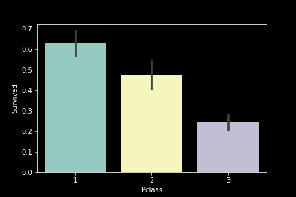
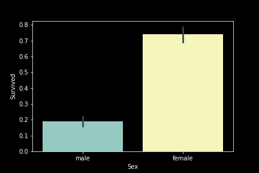
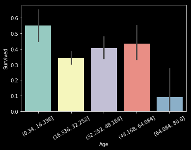
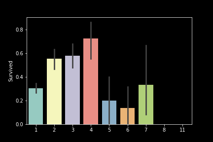
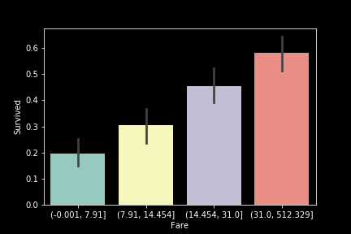
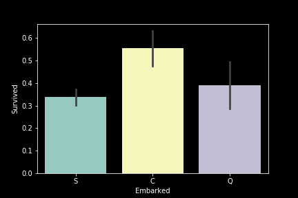

# kaggle.Titanic

This kaggle competition is concerned with predicting deaths on Titanic. Even though the list of people who passed on the infamous ship is available to the public, the challenge remains an interesting place for tinkering with machine learning. There are two sets of data available, both of which can be found at https://www.kaggle.com/c/titanic/data.

## Analysis

The set comprises of 12 columns - 11 features and one target vector - the `Survived` column.

1. `PassengerId` is a unique identifier for each passenger. The column can be used to compare our results at the end, however can be dropped in the training phase, as it adds no value to the predictions.
2. `Pclass` is the passenger class - a categorical variable with 3 classes. This seems to be an important column, as higher-class passengers typically have had a higher priority to be saved. Indeed, as the figure below shows, the survival rates for 1st class passengers were significantly higher.  
   
3. `Name` is the passenger class - a categorical variable with 3 classes. Upon inspection, it can be seen that this column contains each passenger's title - _Mr._/_Mrs._/_Miss._ etc.. It is possible to extract multiple categories for the various titles of the people on board. It would be expected that people with rare titles (e.g. _Countess_, _Don_, etc.) will have a higher priority to be rescued. Additionally, we can determine the gender of the passenger, in case that information was not provided.
4. `Sex` is the gender of the passenger - a categorical variable which can be either _male_ or _female_. It is a well known fact that women and children on Titanic were more likely to be saved, hence this column could have a high significance for the model. If we look at the survival rates, a high percentage of females survived, in contrast to the males.
   
5. `Age` is a continuous variable, indicating the age of the passenger. As also previously mentioned, age could have a high significance for the model. Since it can be difficult to visualise and work with continuous variables, we can choose to transform it into a categorical column, by splitting it into multiple ranges. In the example plot below, five bins have been created, allowing us to distribute values amongst them. We can see that passengers younger than 16 have had a much higher survival rate, in contrast to the elderly people above 64. Additionally, age is the first column, where we observe missing entries in the dataset. Since the column has a normal distribution, a mean imputer would be a suitable choice to replace the missing values.
   
6. `SibSp` defines the number of siblings the passenger had on board. It could be a good predictor, as people with siblings on board might have had a higher chance of survival. We can use it individually, or combine it with Parch, to get a more complete picture of the family survival rate on the ship.
7. `Parch` defines the number of parents or children the passenger had on board. Once again, a column that can be potentially valuable for our predictions. Together with `SibSp` we can form a new column, which will indicate the amount of family the passengers had on board with them. An interesting observation based on the illustration below, is that people who were alone on board had a much lower survival rate.
   
8. `Ticket` represents the ticket number. While this information may be somewhat useful for filling out missing values in other features, it is highly unlikely that it will add much value to our model. Even though we can see that families often used the same ticket number, this information will simply override what will be provided by the previously mentioned `FamilySize` column.
9. `Fare` is another continuous variable, indicating the price each passenger paid to get onboard the ship. This column could be a strong indicator for the survival rate, as it is expected that people who paid more were prioritized for saving. Once again, we can visualise continuous variables by using bins and grouping the values at certain ranges. In the example below, we can see 4 bins and it can be clearly seen that the higher the price, the higher the survival rate. Note that we have used a quantile-based discretization function, which illustrates that the majority of tickets are priced between 0.001 and 31, while only a few passengers paid more. The test data has a number of missing values inside this column. Due to the multiple outliers, it is likely a good idea to use a median-based inputer to fill-in the missing data.  
   
10. `Cabin` indicates the cabin number the passenger had on board. Upon inspection, it can be seen that some passengers had multiple cabins, possibly due to the fact they were a part of a larger family. Since most passengers likely had different cabins, except the ones with family on board, this feature is merely another identifier for each passenger. It is highly unlikely that it will have a significant importance to the model.
11. `Embarked` is another categorical variable, indicating the place of onboarding for each passenger. _C_ stands for _Cherbourg_, _Q_ stands for _Queenstown_ and _S_ stands for _Southampton_. As we can see on the illustration below, many more passengers that embarked at _Cherbourg_ eventually survived, hence this could be a useful column for our model.
    
